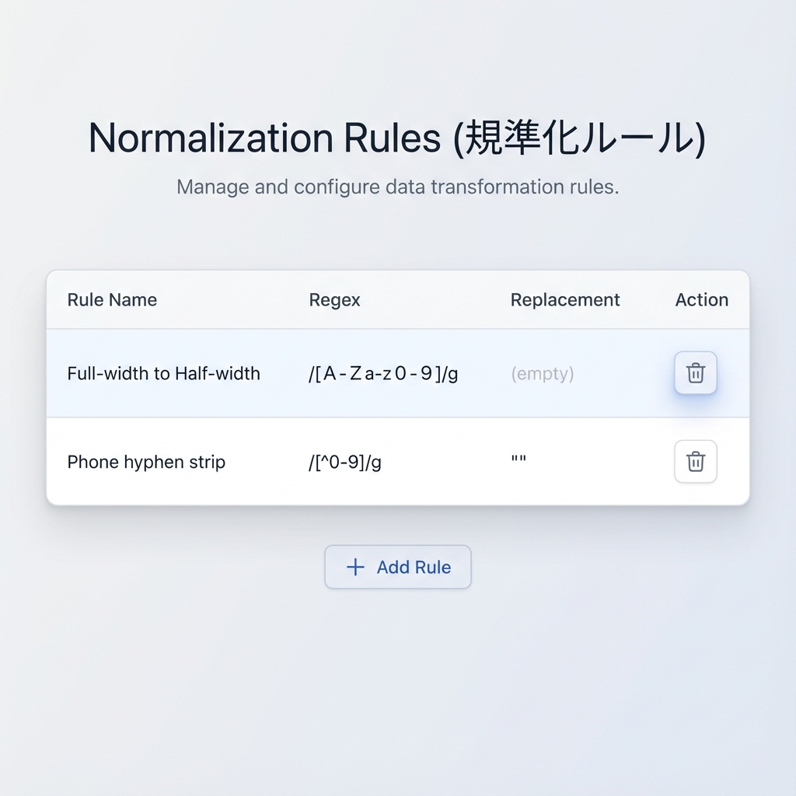
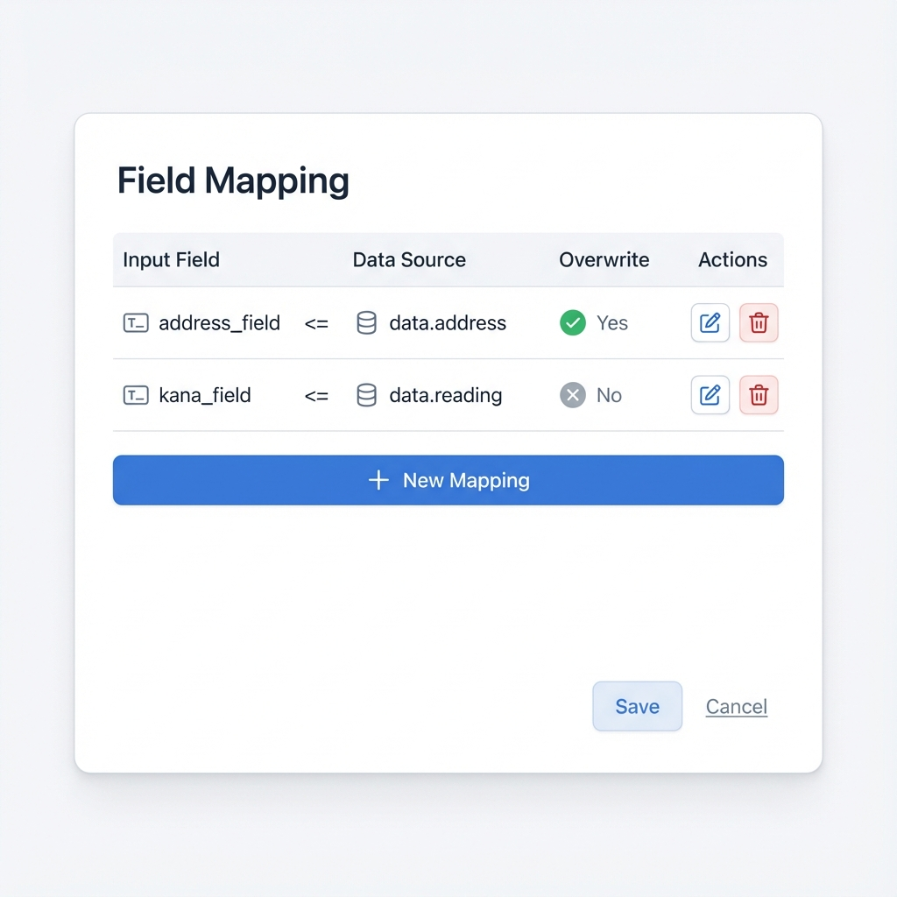
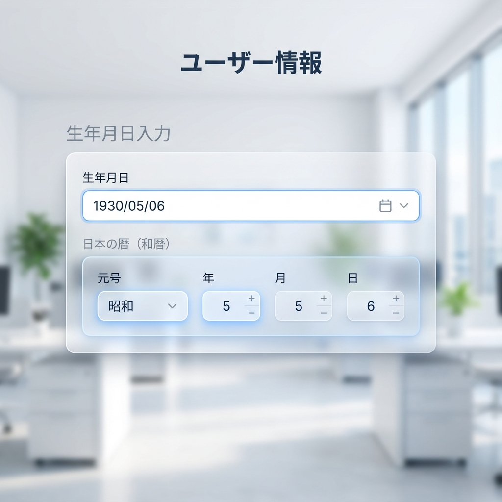
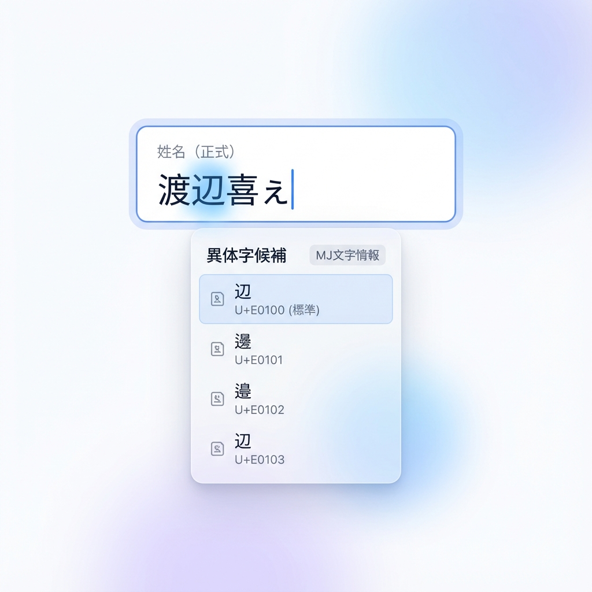

# UI仕様書 (UI Design Specification)

本ドキュメントは、フォーム操作拡張スイート (Core, Japan Presets, Japan Interfaces) によって提供される、設定画面およびユーザーインターフェースの詳細仕様である。

## 1. フィールド設定画面 (Schema Settings)

各フィールドコンポーネントの設定メニュー（Schema Settings）に、拡張機能に応じた設定項目を追加する。

### 1-1. 全体構造
NocoBase標準の設定モーダルに、本スイートが提供する設定を統合する。汎用的なロジック（Core）は共通タブに、日本固有のUI（Interfaces）は専用のプロパティとして配置する。

### 1-2. コア機能設定 (plugin-advanced-form-core)

#### A. 自動規準化 (Auto Normalization)
入力値を自動的に整形・規準化する設定。

| 項目名 | タイプ | 説明 |
| :--- | :--- | :--- |
| **自動修正を有効にする** | Switch | ONで設定を表示。|
| **よく使うルール** | Checkbox | `プリセットロジック` |
| **ルール** | List | ルールの設定の表。|

* プリセットロジックには、`英数字を半角に統一`, `ひらがなに統一`, `カタカナに統一`, `標準漢字に統一`, `電話番号ハイフン統一`が含まれる。これらは日本向け設定プリセットにて提供される。

##### A.1 ルールList
自動規準化のルールListは、表のセルをクリックして直接編集できる。
表の下に「+」ボタンがあり、クリックすると行が追加される。（新規ルール）
表のカラムは以下。

| 項目名 | タイプ | 説明 |
| :--- | :--- | :--- |
| **ルール名** | Input | ルールの名前。 |
| **正規表現** | Input | 正規表現。 |
| **置換文字** | Input | 置換文字。$1,$2,$3のようにグループを参照することができる。 |
| **削除** | Button | ルールを削除する。 |

#### 画面イメージ (規準化ルール設定)

#### B. 自動入力連携 (Auto-fill Engine)
他フィールドに値を設定する。

| 項目名 | タイプ | 説明 |
| :--- | :--- | :--- |
| **キーシーケンスの保持** | Switch | ONで設定を表示。 |
| **自動入力を有効にする** | Switch | ONで設定を表示。 |
| **データソース** | List | データソースの表。編集・削除ボタンあり。また欄外に行追加ボタンあり。 |
| **フィールドマッピング** | List | 入力フィールドと設定する値の対応表 削除ボタンあり。また欄外に新規作成ボタンあり。  |

* キーシーケンスの保存を指定すると、「form.field_name.key_sequence」の形式で参照できる。

##### B.1 フィールドマッピング表
フィールドマッピング表では、行追加ボタンをクリックすると空行が追加される。
またセルをクリックすることで直接編集することができる。
本表のフィールドは以下。

| 項目名 | タイプ | 説明 |
| :--- | :--- | :--- |
| **フィールド名** | Select | 値を設定する入力フィールド名。 |
| **参照式** | Input | データの参照名を含む計算式 |
| **上書き** | Radio | `する`, `しない` |
| **削除** | Button | フィールドマッピングを削除する。 |

#### 画面イメージ (フィールドマッピング設定)

#### C. 候補リスト表示 (Candidate List / Suggestion)
入力中に候補リストを表示し、選択可能にする設定。

| 項目名 | タイプ | 説明 |
| :--- | :--- | :--- |
| **候補リストを有効にする** | Switch | ONで設定を表示 |
| **初期表示タイミング** | Select | `フォーカス時`, `1文字入力後`, ... , `5文字入力後`  |
| **入力ごとの絞り込み** | Radio | `ON`, `OFF` |
| **データソース** | List | データソースの表。編集・削除ボタンあり。また欄外に新規作成ボタンあり。 |
| **ソート** | Radio | `しない`, `昇順`, `降順` |

#### D. データソース定義 (Data Source Definition)
b.およびc.の、データソース表の新規作成/編集　操作により開かれる。データソースの新規作成・編集を行う。

| 項目名 | タイプ | 説明 |
| :--- | :--- | :--- |
| **データソース名** | Input | データソースの名前。 |
| **参照式** | Input | 候補として表示する項目名を含む計算式。 |
| **絞り込み項目名** | Input | 候補の絞り込みに用いる項目名。例えば`kana` |
| **ソートキー** | Input | ソートする項目名。 |
| **検索条件** | Input | データ取得時の検索条件を指定。主にJSON形式のテキスト。 |
| **データソース** | Select | `外部API`, `コレクション`, `フォーム` |
| **コレクション/API名** | Input | コレクション名、API名、またはプリセット名。 |
| **OK** | Button | データソースの作成/編集を完了する。 |
| **Cancel** | Button | データソースの作成/編集を中止する。 |

* 参照式、絞り込み項目名、ソートキーは、C.から開かれた場合のみ表示される。
* 定義したデータソースは、「データソース名.項目名」の形式で参照できる。

## 2. 日本向け特殊インタフェイス (plugin-japan-localization-interfaces)

### 2-1. 和暦日付インタフェイス (Date - Wareki)
標準の日付フィールドの代わりに、和暦入力に特化したUIを提供する。

*   **構成要素**:
    - **メイン入力**: 西暦日付（標準Date）を表示・編集。
    - **和暦補助入力**: 元号(明治〜令和)選択、和暦年、月、日の数値入力。
*   **インタラクション**: 二つの入力群は双方向に同期される。

#### 画面イメージ (和暦入力)

> 和暦補助入力（元号・年・月・日）が日付フィールドと連動して表示される。

### 2-2. MJ文字・正式表記セレクター (Official Name Selector)
「姓名（正式）」等のフィールドで、高度な異体字選択を支援する。

*   **動作**: 文字列中の一文字にカーソルが当たった際、MJ文字情報に基づく異体字候補をポップアップ表示。
*   **表示項目**: 候補文字のみ（シンプルに選択しやすさを優先）。

#### 画面イメージ (正式表記候補)

> カーソル位置の文字「辺」に対し、MJ文字情報に基づいた異体字候補がポップアップされる。

---

## 3. 設定のプリセット管理 (plugin-japan-localization-presets)
ユーザーは煩雑なAPI設定を行わず、プリセットカタログから選択するだけで機能を有効化できる。

*   **住所入力プリセット**: 郵便番号APIのアドレスとマッピング設定のセット。
*   **人名正規化プリセット**: 史料編纂所データベースの変換テーブルを適用した変換ルール。
