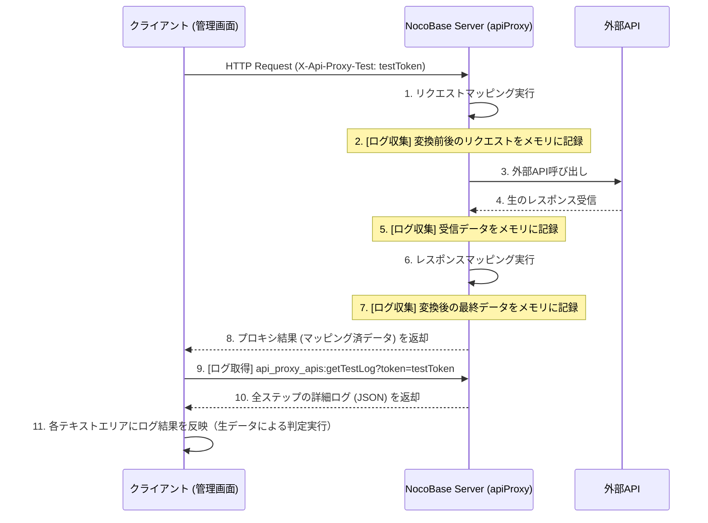

# 文書103: API Proxy テスト機能設計書

## 1. 概要
既存の API Proxy エンドポイントをそのまま使用し、特定のヘッダを付与することで「テストモード」として動作させる仕組みを定義します。これにより、実際のマッピング処理や外部 API との通信を確認できます。

## 2. 通信シーケンス

## 3. テストモードの判別
- クライアントはリクエストヘッダ `X-Api-Proxy-Test` にユニークなトークン（UUID等）を付与します。
- サーバ側 `apiProxy.ts` はこのヘッダを検知した場合、以下の処理を行います。
    - 通信の各ステップ（リクエスト変換前/後、APIレスポンス受信時、最終変換後）のデータを「テストログ」としてメモリ上に記録します。
    - **注意**: 最終変換後のデータはレスポンス(Step 8)としても返されますが、デバッグUIで一気通貫のログとして表示するために、ログ側にも冗長に保持します。

## 4. データの取得方式
案B（指示に基づく方針）を具体化し、**「サーバ側のメモリ（RAM）に、リクエスト単位のトークンをキーとして一時保存し、クライアントが別のアクションで取得する」**方式を採用します。

**なぜ別アクションなのか？**
- `apiProxy` エンドポイントのレスポンス形式を、本番稼働時と同じ状態（外部APIのデータそのもの）に保つためです。
- テスト詳細ログ（どの関数でどう変換されたか等のデバッグ情報）はデータ量が大きくなる可能性があるため、必要な場合のみ別APIで取得します。

## 5. テスト結果の管理
### 5.1 ネットワーク内のメモリ（RAM）キャッシュ
- `PluginApiProxyServer` クラス内のプロパティとして `testLogCache: Map<string, any>` を保持します。
- `Map` は、サーバアプリケーションが動作しているプロセスのメモリ上に展開されます。
- **キー**: クライアントが生成する一意の `testToken` (UUIDなど)。
- **値**: 実行プロセスのデバッグ情報一式。
- **有効期限**: メモリ負荷を避けるため、一定時間（例：5分）で自動削除、または新たなテスト実行時に同じトークンで上書きされます。

### 5.2 処理フロー
1. クライアントが `testToken` を生成。
2. `X-Api-Proxy-Test: testToken` ヘッダを付けてリクエスト。
3. サーバは処理途中のデータを `testDataCache.set(testToken, data)` で保存。
4. クライアントはプロキシリクエスト完了後、 `api_proxy_apis:getTestLog?token=testToken` を呼び出して詳細データを取得。

### 5.3 テスト結果の判定 (OK/NG)
「期待されるレスポンス」との比較は、**外部APIから受信した生データ (apiRawResponse)** を対象に行います。

- **判定ロジック**:
    - **JSON判定**: 両者が有効なJSON形式の場合、オブジェクトとしてパースし、キーの順序を問わず中身が一致すれば OK。
    - **テキスト判定**: JSONでない場合、またはパースに失敗した場合は、文字列としての完全一致で判定。
- **表示**:
    - デバッグUI上の「レスポンス」フィールドには、混乱を避けるため、マッピング後のデータではなく「外部APIの生データ」を優先表示するか、明確に区分して表示。

## 6. 実装の変更点

### 6.1 サーバ側 (apiMapper.ts / apiProxy.ts)
- 各マッピング処理で、テストモード時（ヘッダ存在時）に情報を記録するフックを呼び出す。

### 6.2 サーバ側 (testAction.ts / plugin.ts)
- `getTestLog` アクションを実装し、キャッシュからデータを返却する。

### 6.3 クライアント側 (hooks.ts)
- `useRunTestActionProps` を更新。
    - プロキシ用URLの構築と実行。
    - 完了後、 `getTestLog` を実行して各フィールドを更新。
