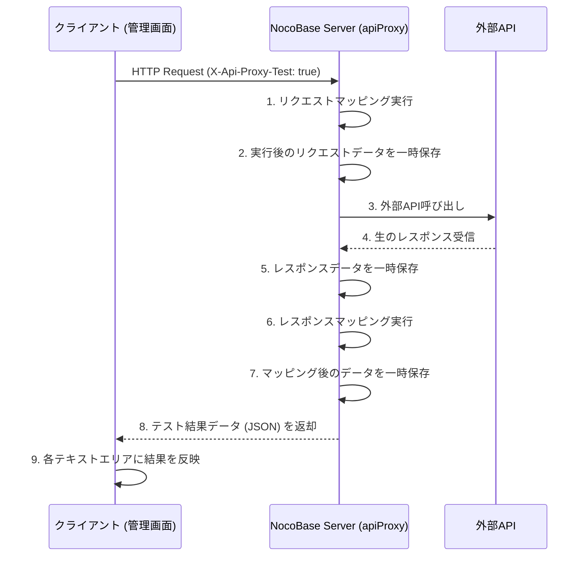

# 文書103: API Proxy テスト機能設計書

## 1. 概要
既存の API Proxy エンドポイントをそのまま使用し、特定のヘッダを付与することで「テストモード」として動作させる仕組みを定義します。これにより、実際のマッピング処理や外部 API との通信を確認できます。

## 2. 通信シーケンス

## 3. テストモードの判別
- クライアントはリクエストヘッダ `X-Api-Proxy-Test: true` を付与します。
- サーバ側 `apiProxy.ts` はこのヘッダを検知した場合、以下の処理を行います。
    - 通信の各ステップ（リクエスト変換後、APIレスポンス受信時、最終変換後）のデータをキャプチャします。

## 4. データの取得方式
ユーザーの「どこかに保存して取得する」という方針に基づき、以下のいずれかの方式を採用します。

### 案A: レスポンスに直接含める
テストモード時は、外部APIへの通信結果そのものではなく、キャプチャしたすべての情報を含む JSON をレスポンスボディとして返します。
- **メリット**: 追加のAPI呼び出しが不要。
- **デメリット**: 外部APIが成功しても、クライアントが受け取るのはメタデータになる（テストUI側でパースするので問題なし）。

### 案B: 一時ストレージに保存し、別アクションで取得（指示に基づく方針）
サーバ側のキャッシュやインスタンス内のメモリにテスト実行データを一時保存し、クライアントがレスポンスを受け取った後に別のアクションでその詳細データを取得します。

**決定**: ユーザーの指示に合わせ、**「サーバ側のメモリに一時保存し、クライアントが別のアクションで取得する」**方式を採用します。

## 5. テスト結果の管理
### 5.1 ストレージ
- `PluginApiProxyServer` クラス内に `testDataCache: Map<string, any>` を保持。
- キーはユーザーIDまたはセッションベースの識別子、もしくはリクエスト時にクライアントが生成する一意の `testToken` 。

### 5.2 処理フロー
1. クライアントが `testToken` を生成。
2. `X-Api-Proxy-Test: testToken` ヘッダを付けてリクエスト。
3. サーバは処理途中のデータを `testDataCache.set(testToken, data)` で保存。
4. クライアントはプロキシリクエスト完了後、 `api_proxy_apis:getTestLog?token=testToken` 等のアクションを呼び出してデータを取得。

## 6. 実装の変更点

### 6.1 サーバ側 (apiMapper.ts / apiProxy.ts)
- 各マッピング処理で、テストモード時（ヘッダ存在時）に情報を記録するフックを呼び出す。

### 6.2 サーバ側 (testAction.ts / plugin.ts)
- `getTestLog` アクションを実装し、キャッシュからデータを返却する。

### 6.3 クライアント側 (hooks.ts)
- `useRunTestActionProps` を更新。
    - プロキシ用URLの構築と実行。
    - 完了後、 `getTestLog` を実行して各フィールドを更新。
